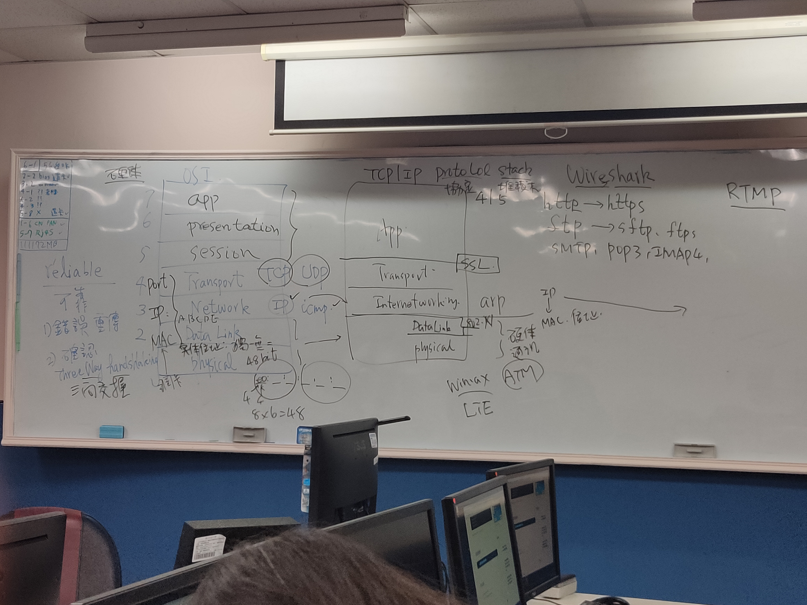
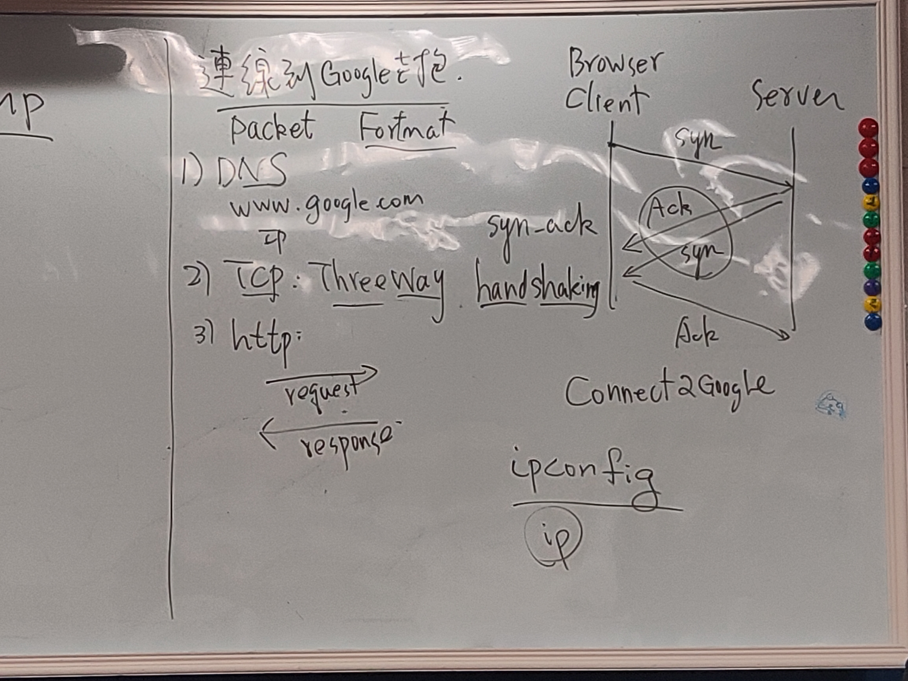

# computer network計算機網路   網路概論


說明OSI Model與 TCP/IP protocol




# 協定protocol

何謂communcation protocol[簡稱協定protocol]?
```
所謂的『Protocol』是指在網路上一種可以彼此溝通的模式，雙方都要依照某些規則進行溝通
```
WHY Layering為何要分層?
```
主要是在網路通訊的整個過程中，將整個流程細化開來，每一層完成各自的事情，互不干擾。

 ( 就好比你現在要炒一盤青菜，總不可能，青菜自己種，油、鍋子、炒鏟也是自己製造，
這樣你要吃到一盤青菜到底需要多少時間阿，所以網路七層只要依據各個層級規範，就可以專注發展。 ) 

優點:
1.降低複雜的程度，使得程式更容易修改，加快產品的研發速度
2.分層負責，每層都有屬於自己的工作
3.提供網路標準
4.易於理解整體架構

```


## 各種協定
```
簡述下列協定protocol
須回答
(A)英文全名
(B)運作在那一層?
(C)主要功能
(D)相關工具或伺服器
```

### application層

* HTTP vs HTTPS  
```
http是網頁與您的電腦瀏覽器直接透過明文進行傳輸，以一般(非安全)模式下進行互動交談，所以在網際網路上內容有可能遭攔有心人士截竊聽的，HTTP協定不使用加密協定，其中原因包含：加密會多消耗許多運算資源，也會佔用更多的傳輸頻寬，而緩存機制跟著會失效。

反觀HTTPS協定，以保密為前提為研發，可以算是HTTP的進階安全版。是以加入SSL協定作為
安全憑證，因此網站透過協定上的加密機制後能夠防止資料竊取者就算攔截到了傳輸資訊卻也無法直接看到傳輸中的資料，也因此較大型有串聯金融信用機制會使用到較敏感度資料的企業網站多會選擇使用HTTPS協定，提供保障客戶在網站上的使用資訊。
```
* HTTP  
```
(A)英文全名:        HyperText Transfer Protocol Secure
(B)運作在那一層?:    application層
(C)主要功能:        是用於從WWW伺服器傳輸超文本到本地瀏覽器的傳送協議
(D)相關工具或伺服器:  Apache , IIS , nginx
```  
* HTTPS  
```
(A)英文全名:        HyperText Transfer Protocol
(B)運作在那一層?:    application層
(C)主要功能:        HTTPS經由HTTP進行通訊，但利用SSL/TLS來加密封包。HTTPS開發的主要目的，是提供對網站伺服器的身分認證，保護交換資料的隱私與完整性。
(D)相關工具或伺服器:  Apache , IIS , nginx
```

FTP vs SFTP | FTPS  
* FTP 
```
(A)英文全名:        File Transfer Protocol
(B)運作在那一層?:    application層
(C)主要功能:        是一個用於在電腦網路上在客戶端和伺服器之間進行檔案傳輸的應用層協定
(D)相關工具或伺服器:  FileZilla Server
```  
* SFTP    
(https://kknews.cc/zh-tw/code/rojyjqx.html)  
```
(A)英文全名:        SSH File Transfer Protocol
(B)運作在那一層?:    application層
(C)主要功能:        SFTP是一種安全的文件傳輸協議，一種通過網絡傳輸文件的安全方法；它確保使用私有和安全的數據流來安全地傳輸數據。
(D)相關工具或伺服器:  OpenSSH
```  
* FTPS    
```
(A)英文全名:        ftp-over-ssl      
(B)運作在那一層?:    application層
(C)主要功能:        是一種對常用的檔案傳輸協定（FTP）添加傳輸層安全（TLS）和安全通訊協定（SSL）加密協定支援的擴充協定。
(D)相關工具或伺服器:  
```

TELNET vs SSH  
* TELNET  
```
(A)英文全名:        
(B)運作在那一層?:    application層
(C)主要功能:        是網際網路遠端登錄服務的標準協定和主要方式，常用於伺服器的遠端控制，可供使用者在本地主機執行遠端主機上的工作。
(D)相關工具或伺服器:  
```  
* SSH  
```
(A)英文全名:        Secure Shell     
(B)運作在那一層?:    application層
(C)主要功能:        是一個連線加密機制,它讓我們在與遠端電腦（遠端伺服器）連線時，能夠先將訊息加密過後再傳送，並且確保只有「被認可的人」才能夠解密訊息。
(D)相關工具或伺服器:  PuTTY,MobaXterm,Xshell,Termius
```
SMTP vs POP3 IMAP 4    
(https://blog.xuite.net/cyclone/blog/56713570)  
```
SMTP - 網際網路中大部分使用者的寄信標準協定

電子郵件的通訊方式該從1960和1970年代開始說起，少數人能夠使用大型電腦（Mainfame Computer）做訊息交換。直到1980年初期RFC 821的制訂，公司團體內部採用這些郵件協定為通訊之用。但是由於各家系統皆不同，以致無法靈活轉碼。從1980到1990年代，在RFC透過各項協定慢慢地將電子郵件的規格統一起來成為現今我們日常不可或缺的資訊溝通的好幫手。

 

POP3 - 網際網路收信標準協定中的老前輩

POP3是一個由J. K. Reynolds帶領的團隊研發的郵件接收協定。它從1984到1998年由POP1、POP2演進至POP3。後來有POP4的架構出來（功能接近IMAP），但是於2003年停止發展。簡單易用，至今仍然被使用中。但是，由於POP4已經停止研發，現有POP3功能已經漸漸不能滿足現在網際網路使用者的需求，造成使用者因需求慢慢轉向IMAP。

 

IMAP - 網際網路收信標準協定中的未來之星

IMAP是什麼？是由一位來自美國史丹福大學知識系統實驗室的Mark Crispin在1986年研發出來的電子郵件的通訊方式。歷經IMAP、IMAP2、IMAP3、IMAP2bis、IMAP4和IMAP4 rev1各種版本後，逐漸成熟且成為業界受歡迎的收信協定。

學員們可以透過EVO MAIL SERVER這套軟體(WINDOWS)來練習架設POP3/SMTP/IMAP郵件伺服器


IMAP同時提供「在線」和「離線」的瀏覽模式；多位使用者可同時瀏覽和管理童一個郵件信箱，所有變動即時生效；使用者可瀏覽點選的部分，無須等待載入整封郵件才能瀏覽；使用者可以使用標籤的方式將「已讀」、「未讀」、「已刪除」、「已回覆」的標籤標記在郵件上，以便郵件管理；使用者可在郵件伺服器上建立資料夾以便做郵件分類；使用者可在遠端的郵件伺服器上做字串搜尋，不用將郵件下載後才能搜尋字串；支援稍早制訂的郵件協定：RFC 2449中提及的功能。
```
* SMTP
```
(A)英文全名:        Simple Mail Transfer Protocol 
(B)運作在那一層?:    application層
(C)主要功能:        網際網路中大部分使用者的寄信標準協定
(D)相關工具或伺服器:  SMTP Prober
```
＊ POP3  
```
(A)英文全名:        Post Office Protocol - Version 3
(B)運作在那一層?:    application層
(C)主要功能:        網際網路收信標準協定中的老前輩
(D)相關工具或伺服器:  
```
＊ IMAP 4  
```
(A)英文全名:        Internet Message Access Protocol
(B)運作在那一層?:    application層
(C)主要功能:        用來從本地郵件客戶端存取遠端伺服器上的郵件。
(D)相關工具或伺服器:  Microsoft Outlook
```

DNS vs DNSsec  
＊ DNS
```
(A)英文全名:        Domain Name System
(B)運作在那一層?:    application層
(C)主要功能:        是一套系統軟體，讓大家所使用及管理的電腦網路系統，能夠作領域名稱(Domain name)與位址(IP address)相互之間的轉換。
(D)相關工具或伺服器:  谷歌 Google Public DNS , 中華電信 Hinet
```
* DNSsec  
```
(A)英文全名:        Domain Name System Security Extensions
(B)運作在那一層?:    application層
(C)主要功能:        這個協議就是確保電話簿中的號碼確實是真實列出的紀錄，使用一組加密密鑰對已發佈出去的 DNS 紀錄進行簽名，使紀錄更難以被偽造。
(D)相關工具或伺服器: 
```

* DHCP
```
(A)英文全名:        Dynamic Host Configuration Protocol
(B)運作在那一層?:    application層
(C)主要功能:        用於內部網路或網路服務供應商自動分配IP位址給用戶  用於內部網路管理員對所有電腦作中央管理
(D)相關工具或伺服器: 
```

* LDAP
```
(A)英文全名:        輕型目錄存取協定（英文：Lightweight Directory Access Protocol)
(B)運作在那一層?:    application層
(C)主要功能:        用於內部網路或網路服務供應商自動分配IP位址給用戶  用於內部網路管理員對所有電腦作中央管理
(D)相關工具或伺服器: 
```
SAMBA

SNMP

RTMP RTSP

MQTT

### transport層  
https://iter01.com/21999.html
```
TCP 與UDP的差異
[1]須說明reliable(可靠) vs un-reliable(不可靠)
[2]如何達到reliable(可靠)
 (A)錯誤重傳
 (B) ThreeWay Handshaking
[3]封包格式 TCP format   vs UDP format 
```
### 
```
IP vs IPsec
ICMP
```
### 連結層
```
ARP
```
# 網路硬體設備 Network Devices
```
簡述底下網路設備:須說明
(A)運作在OSI那一層?
(B)主要功能


(1) HUB
(2) Switch
(3) Router
(4) L4 Switch
(5) Proxy 
```
# 各種address位址
```
PORT address
IP address
MAC address
```

# VPN 名詞解釋  
https://www.johntool.com/vpn-application/   

```

```
